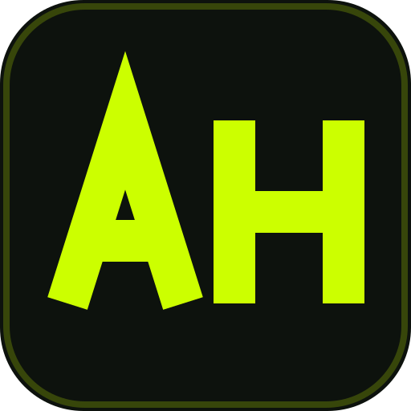

<p align="center">
  
</p>

<h3 align="center">atharvahatekar.github.io</h3>
<p align="center">Personal portfolio — Data Scientist &amp; AI Engineer based in Cottbus, Germany</p>

<p align="center">
  <a href="https://atharvahatekar.github.io">Live Site</a> &middot;
  <a href="https://github.com/atharvahatekar">GitHub</a> &middot;
  <a href="https://linkedin.com/in/atharvahatekar">LinkedIn</a>
</p>

---

## Stack

| Layer | Tech |
|-------|------|
| Markup | Vanilla HTML / CSS / JS — no build step |
| Fonts | Playfair Display, Fira Code, DM Sans (Google Fonts) |
| Data | GitHub API (projects), localized content in `js/i18n.js` |
| i18n | EN / DE, persisted in `localStorage` |
| Hosting | GitHub Pages |

## Pages

```
index.html      Hero, skills grid, featured projects, interactive contact terminal
projects.html   Curated project cards, hydrated live from the GitHub API
cv.html         Role timeline, skill density heatmap, education & publication dossier
404.html        Terminal-styled not-found page
```

## Quick Start

```bash
python -m http.server 8000
# → http://localhost:8000
```

## Structure

```
├── index.html / cv.html / projects.html / 404.html
├── style.css                 # Global styles, themes, palette/terminal/aurora
├── css/index.css             # Homepage-specific styles
├── js/
│   ├── i18n.js               # Translations, CV/project content, language switcher, typewriter
│   ├── index.js              # Homepage interactions (reveal, rotation, stagger)
│   ├── palette.js            # ⌘K command palette
│   └── terminal.js           # Interactive contact terminal
├── cv-section/               # CV renderer: role timeline, heatmap, dossier
├── theme-init.js             # Blocks FOUC — sets saved theme before paint
├── loader.js                 # GitHub integration, caching, theme toggle, nav
├── tests/run_tests.sh        # CI checks: structure, assets, SEO, contrast
├── tools/                    # Authoring helpers (Pillow), not part of the site
│   ├── optimize-photos.py    #   resize + WebP the hero photos
│   ├── make-preview-card.py  #   render content/preview-card.png (Open Graph)
│   └── make-linkedin-banner.py  # render content/linkedin-banner.png (1584x396)
└── content/
    ├── icon.svg              # Favicon (AH monogram)
    ├── preview-card.png      # Open Graph / social preview card
    ├── Atharva_Hatekar_CV_2026.pdf
    ├── company-logos/        # Employer wordmarks used in the CV timeline
    └── img/profile/          # Hero portraits (profile-01.webp, …)
```

## Features

- **⌘K command palette** — keyboard-first navigation, theme & language switching
- **Interactive contact terminal** — type `help` on the homepage
- **Session caching** — GitHub responses cached 1h in `sessionStorage`; project
  cards render instantly from curated metadata even if the API is down
- **Dark / light themes** — WCAG-checked contrast, `prefers-reduced-motion` respected

## Theming

Two themes controlled via the `data-theme` attribute on `<html>`:

| | Dark (default) | Light |
|---|---|---|
| Background | `#080c08` | `#f5f2eb` |
| Accent | `#ccff00` | `#1a5c00` |
| Display font | Playfair Display | Playfair Display |
| Code font | Fira Code | Fira Code |

Built by [Atharva Hatekar](https://github.com/atharvahatekar)
